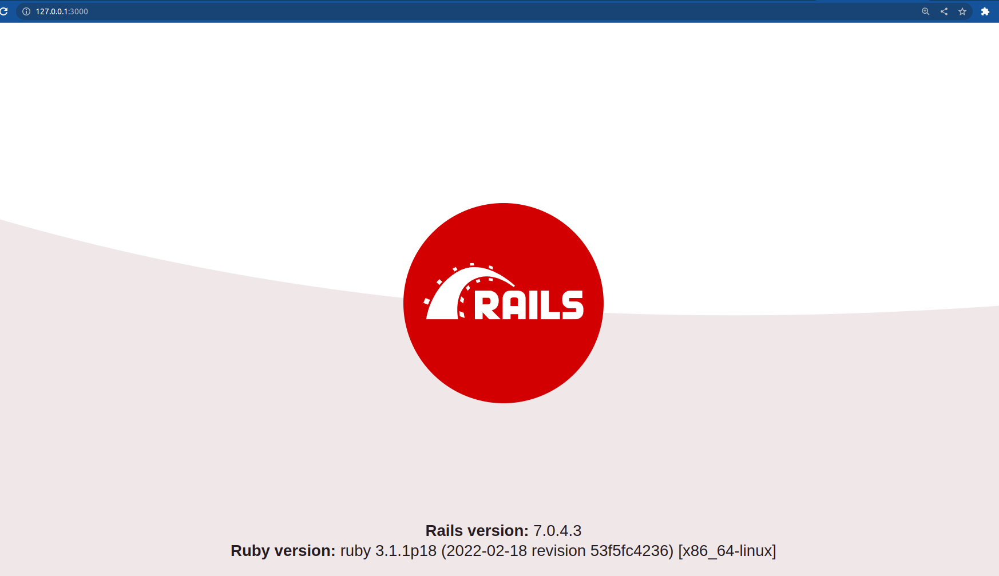
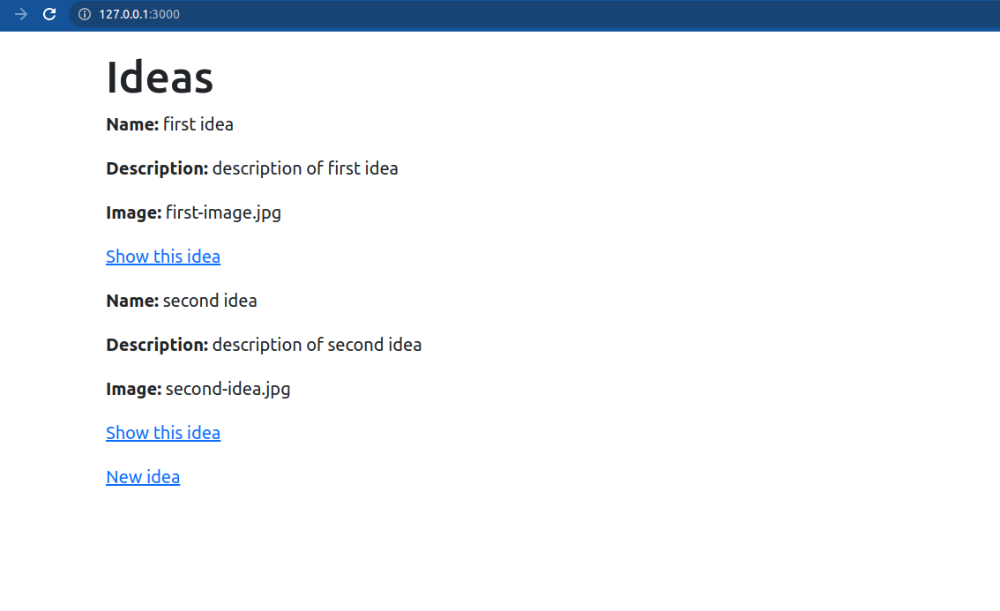

# Ruby and Ruby on Rails Workshop

## Preprequisite

1. Ruby 3.1.1
2. Ruby on Rails 7+

## Getting started with app

1. Get started with Rails app by running following command:

    ```sh
    rails new ideapasal
    ```

  <details>
  <summary><b>Output Logs</b></summary>

```
    create
    create  README.md
    create  Rakefile
    create  .ruby-version
    create  config.ru
    create  .gitignore
    create  .gitattributes
    create  Gemfile
        run  git init from "."
Initialized empty Git repository in /home/dhanu/dhanu-sir/community-events/ruby-and-rails/ideapasal/.git/
    create  app
    create  app/assets/config/manifest.js
    create  app/assets/stylesheets/application.css
    ... // omitted to reduce lines
    create  config/initializers/filter_parameter_logging.rb
    create  config/initializers/inflections.rb
    create  config/initializers/new_framework_defaults_7_0.rb
    create  config/initializers/permissions_policy.rb
    create  config/locales
    create  config/locales/en.yml
    create  config/master.key
    append  .gitignore
    create  config/boot.rb
    create  config/database.yml
    create  db
    create  db/seeds.rb
    create  lib
    create  lib/tasks
    create  lib/tasks/.keep
    create  lib/assets
    create  lib/assets/.keep
    create  log
    create  log/.keep
    create  public
    create  public/404.html
    create  public/422.html
    create  public/500.html
    create  public/apple-touch-icon-precomposed.png
    create  public/apple-touch-icon.png
    create  public/favicon.ico
    create  public/robots.txt
    create  tmp
    create  tmp/.keep
    create  tmp/pids
    create  tmp/pids/.keep
    create  tmp/cache
    create  tmp/cache/assets
    create  vendor
    create  vendor/.keep
    create  test/fixtures/files
    create  test/fixtures/files/.keep
    ... // omitted to reduce lines
    create  test/application_system_test_case.rb
    create  storage
    create  storage/.keep
    create  tmp/storage
    create  tmp/storage/.keep
    remove  config/initializers/cors.rb
    remove  config/initializers/new_framework_defaults_7_0.rb
        run  bundle install
Fetching gem metadata from https://rubygems.org/...........
Resolving dependencies...
Using rake 13.0.6
Using concurrent-ruby 1.2.2
Using minitest 5.18.0
Using builder 3.2.4
Using erubi 1.12.0
Using io-console 0.6.0
Using method_source 1.0.0
Using thor 1.2.1
Using zeitwerk 2.6.7
Using rexml 3.2.5
Using rubyzip 2.3.2
Using date 3.3.3
Using websocket 1.2.9
Using timeout 0.3.2
Fetching sqlite3 1.6.2 (x86_64-linux)
Using bindex 0.8.1
Fetching regexp_parser 2.8.0
Using matrix 0.4.2
Fetching selenium-webdriver 4.9.0
Fetching reline 0.3.3
Using racc 1.6.2
Using crass 1.0.6
Fetching nio4r 2.5.9
Using websocket-extensions 0.1.5
Using marcel 1.0.2
Using websocket-driver 0.7.5
Using mini_mime 1.1.2
Using i18n 1.12.0
Using public_suffix 5.0.1
Using tzinfo 2.0.6
Using bundler 2.4.12
Using rack 2.2.6.4
Fetching msgpack 1.7.0
Using rack-test 2.1.0
Using sprockets 4.2.0
Using activesupport 7.0.4.3
Using addressable 2.8.4
Using nokogiri 1.14.3 (x86_64-linux)
Using net-protocol 0.2.1
Fetching loofah 2.20.0
Using activemodel 7.0.4.3
Using net-pop 0.1.2
Using net-smtp 0.3.3
Using globalid 1.1.0
Using xpath 3.2.0
Using net-imap 0.3.4
Using rails-dom-testing 2.0.3
Using activerecord 7.0.4.3
Using activejob 7.0.4.3
Using mail 2.8.1
Installing loofah 2.20.0
Installing reline 0.3.3
Installing msgpack 1.7.0 with native extensions
Installing regexp_parser 2.8.0
Installing nio4r 2.5.9 with native extensions
Using rails-html-sanitizer 1.5.0
Using actionview 7.0.4.3
Using actionpack 7.0.4.3
Using jbuilder 2.11.5
Using actionmailer 7.0.4.3
Using railties 7.0.4.3
Using sprockets-rails 3.4.2
Using activestorage 7.0.4.3
Using importmap-rails 1.1.5
Using stimulus-rails 1.2.1
Using turbo-rails 1.4.0
Using web-console 4.2.0
Using actionmailbox 7.0.4.3
Using actiontext 7.0.4.3
Fetching irb 1.6.4
Fetching capybara 3.39.0
Installing irb 1.6.4
Fetching debug 1.7.2
Installing selenium-webdriver 4.9.0
Installing capybara 3.39.0
Installing debug 1.7.2 with native extensions
Using webdrivers 5.2.0
Installing sqlite3 1.6.2 (x86_64-linux)
Using actioncable 7.0.4.3
Using puma 5.6.5
Using rails 7.0.4.3
Using bootsnap 1.16.0
Bundle complete! 15 Gemfile dependencies, 72 gems now installed.
Use `bundle info [gemname]` to see where a bundled gem is installed.
        run  bundle binstubs bundler
      rails  importmap:install
Add Importmap include tags in application layout
    insert  app/views/layouts/application.html.erb
Create application.js module as entrypoint
    create  app/javascript/application.js
Use vendor/javascript for downloaded pins
    create  vendor/javascript
    create  vendor/javascript/.keep
Ensure JavaScript files are in the Sprocket manifest
    append  app/assets/config/manifest.js
Configure importmap paths in config/importmap.rb
    create  config/importmap.rb
Copying binstub
    create  bin/importmap
      rails  turbo:install stimulus:install
Import Turbo
    append  app/javascript/application.js
Pin Turbo
    append  config/importmap.rb
Enable redis in bundle
      gsub  Gemfile
        run  bundle install
Fetching gem metadata from https://rubygems.org/..........
Resolving dependencies...
Using rake 13.0.6
Using concurrent-ruby 1.2.2
Using bundler 2.4.12
Using bindex 0.8.1
Using matrix 0.4.2
Using regexp_parser 2.8.0
Using io-console 0.6.0
Using method_source 1.0.0
Using thor 1.2.1
Using zeitwerk 2.6.7
Using redis 4.8.1
Using rexml 3.2.5
Using rubyzip 2.3.2
Using websocket 1.2.9
Using sqlite3 1.6.2 (x86_64-linux)
Using builder 3.2.4
Using i18n 1.12.0
Using tzinfo 2.0.6
Using reline 0.3.3
Using selenium-webdriver 4.9.0
Using erubi 1.12.0
Using racc 1.6.2
Using crass 1.0.6
Using rack 2.2.6.4
Using nio4r 2.5.9
Using websocket-extensions 0.1.5
Using marcel 1.0.2
Using mini_mime 1.1.2
Using date 3.3.3
Using timeout 0.3.2
Using public_suffix 5.0.1
Using msgpack 1.7.0
Using minitest 5.18.0
Using nokogiri 1.14.3 (x86_64-linux)
Using rack-test 2.1.0
Using websocket-driver 0.7.5
Using net-protocol 0.2.1
Using addressable 2.8.4
Using bootsnap 1.16.0
Using irb 1.6.4
Using puma 5.6.5
Using sprockets 4.2.0
Using activesupport 7.0.4.3
Using loofah 2.20.0
Using net-imap 0.3.4
Using net-pop 0.1.2
Using net-smtp 0.3.3
Using xpath 3.2.0
Using debug 1.7.2
Using webdrivers 5.2.0
Using rails-dom-testing 2.0.3
Using rails-html-sanitizer 1.5.0
Using globalid 1.1.0
Using actionview 7.0.4.3
Using activemodel 7.0.4.3
Using mail 2.8.1
Using actionpack 7.0.4.3
Using activejob 7.0.4.3
Using jbuilder 2.11.5
Using actioncable 7.0.4.3
Using activerecord 7.0.4.3
Using actionmailer 7.0.4.3
Using railties 7.0.4.3
Using sprockets-rails 3.4.2
Using capybara 3.39.0
Using web-console 4.2.0
Using activestorage 7.0.4.3
Using importmap-rails 1.1.5
Using actionmailbox 7.0.4.3
Using actiontext 7.0.4.3
Using stimulus-rails 1.2.1
Using turbo-rails 1.4.0
Using rails 7.0.4.3
Bundle complete! 16 Gemfile dependencies, 73 gems now installed.
Use `bundle info [gemname]` to see where a bundled gem is installed.
Switch development cable to use redis
      gsub  config/cable.yml
Create controllers directory
    create  app/javascript/controllers
    create  app/javascript/controllers/index.js
    create  app/javascript/controllers/application.js
    create  app/javascript/controllers/hello_controller.js
Import Stimulus controllers
    append  app/javascript/application.js
Pin Stimulus
Appending: pin "@hotwired/stimulus", to: "stimulus.min.js", preload: true"
    append  config/importmap.rb
Appending: pin "@hotwired/stimulus-loading", to: "stimulus-loading.js", preload: true
    append  config/importmap.rb
Pin all controllers
Appending: pin_all_from "app/javascript/controllers", under: "controllers"
    append  config/importmap.rb
```

  </details>

2. Enter into the folder `ideapasal` and open the application in the editor:

    ```
    cd ideapasal
    code .
    ```

  __NOTE:__ You can use your favorite editor.

3. Now run the server by running following command:

    ```sh
    rails s
    ```

4. Open the url [http://localhost:3000](http://localhost:3000) in the browser, you should see following output:

  

## Create the scaffold for Idea

1. Run the following command to create the scaffold of idea that will allows you to list, add, remove, edit, and view ideas:

    ```sh
    rails generate scaffold idea name:string description:text image:string
    ```

    <details>
    <summary><b>Output Log</b></summary>

    ```
    invoke  active_record
    create    db/migrate/20230421030457_create_ideas.rb
    create    app/models/idea.rb
    invoke    test_unit
    create      test/models/idea_test.rb
    create      test/fixtures/ideas.yml
    invoke  resource_route
      route    resources :ideas
    invoke  scaffold_controller
    create    app/controllers/ideas_controller.rb
    invoke    erb
    create      app/views/ideas
    create      app/views/ideas/index.html.erb
    create      app/views/ideas/edit.html.erb
    create      app/views/ideas/show.html.erb
    create      app/views/ideas/new.html.erb
    create      app/views/ideas/_form.html.erb
    create      app/views/ideas/_idea.html.erb
    invoke    resource_route
    invoke    test_unit
    create      test/controllers/ideas_controller_test.rb
    create      test/system/ideas_test.rb
    invoke    helper
    create      app/helpers/ideas_helper.rb
    invoke      test_unit
    invoke    jbuilder
    create      app/views/ideas/index.json.jbuilder
    create      app/views/ideas/show.json.jbuilder
    create      app/views/ideas/_idea.json.jbuilder
    ```

    </details>

2. Run the following command to update the database and restart the server:

    ```
    rails db:migrate
    rails server
    ```

    <details>
    <summary><b>Output Log</b></summary>

    ```
    == 20230421030457 CreateIdeas: migrating ======================================
    -- create_table(:ideas)
      -> 0.0020s
    == 20230421030457 CreateIdeas: migrated (0.0023s) =============================
    ```

    </details>


3. Open [http://localhost:3000/ideas](http://localhost:3000/ideas) in your Browser.

   You should be able to create new ideas, view, edit and delete them.

## Change the root route of the application

Open the `config/routes.rb` file. After the first line, add this line and save it:

    root to: 'ideas#index'

The `config/routes.rb` fill will look like below:

    Rails.application.routes.draw do
      root to: 'ideas#index'

      resources :ideas
    end

__NOTE:__ You should put the root route at the top of the file, because it is the most popular route and should be matched first.

Now, try to open [http://localhost:3000/](http://localhost:3000/) in your Browser. It will now show the list of ideas.

# Congratulations! You have now created your first app.

## Styling your application

To style the application, we will be using the CSS framework [Bootstrap v5](https://getbootstrap.com/docs/5.2/getting-started/introduction/).

Open the `app/views/layouts/application.html.erb` file and above the following line:

```
<%= stylesheet_link_tag "application", "data-turbo-track": "reload" %>
```

add this line to the file:

```
<link href="https://cdn.jsdelivr.net/npm/bootstrap@5.2.3/dist/css/bootstrap.min.css" rel="stylesheet" integrity="sha384-rbsA2VBKQhggwzxH7pPCaAqO46MgnOM80zW1RWuH61DGLwZJEdK2Kadq2F9CUG65" crossorigin="anonymous">
```

__NOTE:__  It loads Bootstrap from a server on the Internet and you don’t have to install it locally before you can use it.

Now, in the same file, replace this line `<%= yield %>` with the following lines:

```
<div class="container">
  <%= yield %>
</div>
```

Your application should looke like below:



### Add a navigation bar

In the file `app/views/layouts/application.html.erb`, under the `<body>` tag add the following lines of code. This will add a navigation bar to the app.

```
<nav class="navbar navbar-expand-lg navbar-dark bg-dark">
  <div class="container-fluid">
    <a class="navbar-brand" href="/">IdeaPasal</a>
    <button class="navbar-toggler" type="button" data-bs-toggle="collapse" data-bs-target="#navbarSupportedContent" aria-controls="navbarSupportedContent" aria-expanded="false" aria-label="Toggle navigation">
      <span class="navbar-toggler-icon"></span>
    </button>
    <div class="collapse navbar-collapse" id="navbarSupportedContent">
      <ul class="navbar-nav mx-auto mb-2 mb-lg-0">
        <li class="nav-item">
          <a class="nav-link <%= 'active' if current_page?(controller: 'ideas') %>" href="/ideas">Ideas</a>
        </li>
      </ul>
    </div>
  </div>
</nav>
```

### Add Footer

Before the `</body>` closing tag at the end of the file, add following lines:

```
<footer class="mt-5 text-center text-white bg-secondary">
  <div class="container">
    IdeaPasal <%= Time.now.year %>
  </div>
</footer>
<script src="https://cdn.jsdelivr.net/npm/bootstrap@5.2.3/dist/js/bootstrap.bundle.min.js" integrity="sha384-kenU1KFdBIe4zVF0s0G1M5b4hcpxyD9F7jL+jjXkk+Q2h455rYXK/7HAuoJl+0I4" crossorigin="anonymous"></script>
```

Save the changes in your files and refresh the Browser to see the changes.

## Add upload image feature

Open the `Gemfile` file in your Text Editor and below the following line:

```
gem "sqlite3"
```

add this line to the file and save it:

```
gem "carrierwave"
```

Open the Terminal app and press `Ctrl+C` to quit the Rails server and then
run the following command in the Terminal:

```
bundle install
```

This will install the `carrierwave` gem which you can use to upload image.

### Generate an image uploader

Let's generate the code to handle image uploads. Run the following command:

```
rails generate uploader Image
```

If an error is shown that the uploader cannot be found also add the following line:

```
gem "net-ssh"
```

If you added this gem, then run `bundle install` again.

### Attaching the image uploader to the idea model

Now, the application knows about a way to upload images. But, it needs a bit of help to understand where you want to attach these uploads to.

Open the model file `app/models/idea.rb`. This file is used to store your ideas in the database and fetch the ideas to show them.

We’ll update it to tell the application which field is a file upload.

Update the file as below:

```
class Idea < ApplicationRecord
  mount_uploader :image, ImageUploader
end
```

The `mount_uploader` line tells the Idea model that the image field is a file upload field. It will store information about the file upload.

### Uploading Images

Now, change the form to create and edit images to select a image.

Open the `app/views/ideas/_form.html.erb` file and change the following line:

```
<%= form.text_field :image %>
```

to this line and save it:

```
<%= form.file_field :image %>
```

### Displaying Images

To show the image in the idea page, open the `app/views/ideas/_idea.html.erb` in the Text editor and change the following line:

```
<%= idea.image %>
```

to this line and save the file:

```
<%= image_tag(idea.image_url, width: 600) if idea.image? %>
```

Refresh the Browser. Your uploaded image should now be visible!


## Final Styling

Now, you will perform final UI changes to your application.

### Update the styling of listing ideas

Update the `app/views/ideas/index.html.erb` file with the following content:

```
<h1>Ideas</h1>

<%= link_to "Add a new idea", new_idea_path, class: "btn btn-primary mb-3" %>

<div class="list-group w-auto">
  <% @ideas.each do |idea| %>
    <%= render idea %>
  <% end %>
</div>
```

### Update the styling of showing idea

Update the `app/views/ideas/show.html.erb` file:

```
<div id="<%= dom_id @idea %>" class="d-flex gap-2 py-3">
  <div class="d-flex flex-column gap-2 w-100">
    <h1><%= @idea.name %></h1>
    <p><%= @idea.description %></p>
    <small class="opacity-50 text-nowrap">Last updated <%= time_ago_in_words @idea.updated_at %></small>
  </div>
  <%= image_tag(@idea.image_url, width: 150, height: 150, class: "img-thumbnail") if @idea.image? %>
</div>

<div class="d-flex gap-2 py-2">
  <%= link_to "Edit this idea", edit_idea_path(@idea), class: "btn btn-primary" %>
  <%= link_to "Back to ideas", ideas_path, class: "btn btn-outline-secondary" %>
  <%= button_to "Destroy this idea", @idea, method: :delete, class: "btn btn-danger", form: { data: { turbo_confirm: "Are you sure?" } } %>
</div>
```

### Update the styling of editing idea

Update the `app/views/ideas/edit.html.erb` file:

```
<h1>Editing idea</h1>

<%= render "form", idea: @idea %>

<br>

<div class="d-flex gap-2 py-2">
  <%= link_to "Show this idea", @idea, class: "btn btn-primary" %>
  <%= link_to "Back to ideas", ideas_path, class: "btn btn-outline-secondary" %>
</div>
```

### Update the styling of idea form

Update the `app/views/ideas/_form.html.erb` file:

```
<%= form_with(model: idea, class: "row g-3") do |form| %>
  <% if idea.errors.any? %>
    <div style="color: red">
      <h2><%= pluralize(idea.errors.count, "error") %> prohibited this idea from being saved:</h2>

      <ul>
        <% idea.errors.each do |error| %>
          <li><%= error.full_message %></li>
        <% end %>
      </ul>
    </div>
  <% end %>

  <div class="col-md-6">
    <div>
      <%= form.label :name, class: "form-label" %><br>
      <%= form.text_field :name %>
    </div>
    <div>
      <%= form.label :description, class: "form-label" %><br>
      <%= form.text_area :description, rows: 8, cols: 55 %>
    </div>
  </div>
  <div class="col-md-6">
    <h2>Idea Image</h2>
    <% if idea.image? %>
      <%= image_tag(idea.image_url, width: 400, class: 'shadow') %>
    <% end %>

    <div class="mt-4">
      <% if idea.image? %>
        <span>Want to update?</span>
      <% end %>

      <%= form.file_field :image %>
    </div>

  </div>

  <div class="mt-4">
    <%= form.submit "Update the Idea", class: "btn btn-lg px-5 btn-success" %>
  </div>
<% end %>
```

### Update the styling of idea partial

Update the `app/views/ideas/_idea.html.erb` file:

```
<div id="<%= dom_id idea %>" class="list-group-item list-group-item-action d-flex gap-3 py-3">
  <div class="d-flex flex-column gap-2 w-100">
    <h2><%= link_to idea.name, idea_path(idea) %></h2>
    <p><%= idea.description %></p>
    <small class="opacity-50 text-nowrap">Last updated <%= time_ago_in_words idea.updated_at %></small>
  </div>
  <%= image_tag(idea.image_url, width: 150, height: 150, class: "img-thumbnail flex-shrink-0") if idea.image? %>
</div>
```
